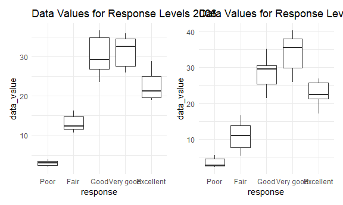
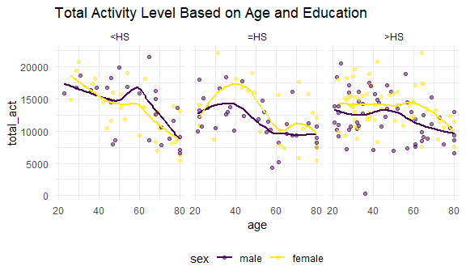

HW2
================
Christina Dai cd3347

``` r
library(tidyverse)
```

    ## ── Attaching core tidyverse packages ──────────────────────── tidyverse 2.0.0 ──
    ## ✔ dplyr     1.1.3     ✔ readr     2.1.4
    ## ✔ forcats   1.0.0     ✔ stringr   1.5.0
    ## ✔ ggplot2   3.4.3     ✔ tibble    3.2.1
    ## ✔ lubridate 1.9.2     ✔ tidyr     1.3.0
    ## ✔ purrr     1.0.2     
    ## ── Conflicts ────────────────────────────────────────── tidyverse_conflicts() ──
    ## ✖ dplyr::filter() masks stats::filter()
    ## ✖ dplyr::lag()    masks stats::lag()
    ## ℹ Use the conflicted package (<http://conflicted.r-lib.org/>) to force all conflicts to become errors

``` r
library(patchwork)

knitr::opts_chunk$set(
  echo = TRUE,
  fig.width = 6,
  fig.asp = 0.6,
  out.width = "90%"
)

theme_set(theme_minimal() + theme(legend.position = "bottom"))

options(
  ggplot2.continuous.colour = "viridis",
  ggplot2.continuous.fill = "viridis"
)

scale_colour_discrete = scale_color_viridis_d
scale_fill_discrete = scale_fill_viridis_d
```

### Problem 1

Loading the instacart data:

``` r
library(p8105.datasets)
data("instacart")
```

This dataset contains information from the grocery delivery service
Instacart. Customers can enlist a shopper, employed by Instacart, to do
their grocery shopping for them at various grocery stores in their area.
The shopper will then deliver the groceries to their door. There are
`nrow(instacart)` rows and `ncol(instacart)` columns total. In this
dataset, each observation corresponds to a specific product and includes
information such as `product_name`, `aisle`, `department`, and
`days_since_prior_order`. For example, the first row in the dataset is
Bulgarian Yogurt in the dairy and eggs department in the yogurt aisle.

How many aisles are there, and which aisles are the most items ordered
from?

``` r
instacart %>% 
  group_by(aisle) %>% 
  summarize(n_obs = n()) %>% 
  arrange(desc(n_obs))
```

    ## # A tibble: 134 × 2
    ##    aisle                          n_obs
    ##    <chr>                          <int>
    ##  1 fresh vegetables              150609
    ##  2 fresh fruits                  150473
    ##  3 packaged vegetables fruits     78493
    ##  4 yogurt                         55240
    ##  5 packaged cheese                41699
    ##  6 water seltzer sparkling water  36617
    ##  7 milk                           32644
    ##  8 chips pretzels                 31269
    ##  9 soy lactosefree                26240
    ## 10 bread                          23635
    ## # ℹ 124 more rows

There are 134 different aisles in the data and the most items are
ordered from the fresh vegetables and fresh fruits aisles. These two
aisles had nearly twice as many orders than the 3rd most ordered from
aisle, which was packaged vegetables and fruits.

Make a plot for `aisles`:

``` r
instacart %>% 
  group_by(aisle) %>% 
  summarize(n_obs = n()) %>% 
  filter(n_obs > 10000) %>% 
  arrange(desc(n_obs)) %>%
  ggplot(aes(x = aisle, y = n_obs)) + 
  geom_bar(stat = "identity") + 
  theme(axis.text.x = element_text(angle = 90, hjust = 1))
```


Make a table showing the three most popular items in each of the aisles
“baking ingredients”, “dog food care”, and “packaged vegetables fruits”:

``` r
aisles_pop = 
  instacart %>% 
    filter(aisle == "baking ingredients" | aisle == "dog food care" | aisle == "packaged vegetables fruits") %>% 
    group_by(aisle, product_name) %>% 
    summarize(n_prod = n()) %>% 
    arrange(desc(n_prod)) %>% 
  group_by(aisle) %>% 
  slice(1:3) 
```

    ## `summarise()` has grouped output by 'aisle'. You can override using the
    ## `.groups` argument.

``` r
  knitr::kable(aisles_pop)
```

| aisle                      | product_name                                  | n_prod |
|:---------------------------|:----------------------------------------------|-------:|
| baking ingredients         | Light Brown Sugar                             |    499 |
| baking ingredients         | Pure Baking Soda                              |    387 |
| baking ingredients         | Cane Sugar                                    |    336 |
| dog food care              | Snack Sticks Chicken & Rice Recipe Dog Treats |     30 |
| dog food care              | Organix Chicken & Brown Rice Recipe           |     28 |
| dog food care              | Small Dog Biscuits                            |     26 |
| packaged vegetables fruits | Organic Baby Spinach                          |   9784 |
| packaged vegetables fruits | Organic Raspberries                           |   5546 |
| packaged vegetables fruits | Organic Blueberries                           |   4966 |

Table for hour of day Pink Lady Apples and Coffee Ice Cream are ordered
for each day of the week:

``` r
apples_coffee = 
  instacart %>% 
  filter(product_name == "Pink Lady Apples" | product_name == "Coffee Ice Cream") %>% 
  group_by(product_name, order_dow) %>% 
  summarize(mean_hr = mean(order_hour_of_day)) %>% 
  pivot_wider(
    names_from = order_dow,
    values_from = mean_hr
  )
```

    ## `summarise()` has grouped output by 'product_name'. You can override using the
    ## `.groups` argument.

``` r
  knitr::kable(apples_coffee)
```

| product_name     |        0 |        1 |        2 |        3 |        4 |        5 |        6 |
|:-----------------|---------:|---------:|---------:|---------:|---------:|---------:|---------:|
| Coffee Ice Cream | 13.77419 | 14.31579 | 15.38095 | 15.31818 | 15.21739 | 12.26316 | 13.83333 |
| Pink Lady Apples | 13.44118 | 11.36000 | 11.70213 | 14.25000 | 11.55172 | 12.78431 | 11.93750 |

### Problem 2

Loading the BRFSS data:

``` r
library(p8105.datasets)
data("brfss_smart2010")
```

Data cleaning:

``` r
brfss_clean = 
  brfss_smart2010 %>% 
  janitor::clean_names() %>% 
  rename(state = locationabbr, state_county = locationdesc) %>% 
  filter(topic == "Overall Health") %>% 
  filter(response == "Excellent" | response == "Very good" | response == "Good" | response == "Fair" | response == "Poor") %>% 
  mutate(response = as.factor(response)) %>% 
  mutate(response = factor(response, levels = c("Poor", "Fair", "Good", "Very good", "Excellent")))
```

In 2002, which states were observed at 7 or more locations? What about
in 2010?

``` r
locations2002 = 
  brfss_clean %>% 
    group_by(state) %>% 
    filter(year == 2002) %>% 
    summarize(n_counties = n_distinct(state_county)) %>% 
    filter(n_counties >= 7)
```

``` r
locations2010 = 
  brfss_clean %>% 
    group_by(state) %>% 
    filter(year == 2010) %>% 
    summarize(n_counties = n_distinct(state_county)) %>% 
    filter(n_counties >= 7)
```

In 2002, CA, CO, FL, MA, MD, NC, NE, NJ, NY, OH, PA, SC, TX, and WA were
observed at 7 or more locations.

In 2010, CT, FL, MA, NC, NJ, and PA were observed at 7 or more
locations.

Spaghetti plot:

Modifying the data

``` r
excellent = 
  brfss_clean %>% 
  filter(response == "Excellent") %>% 
  group_by(year, state) %>% 
  summarize(data_value_avg = mean(data_value))
```

    ## `summarise()` has grouped output by 'year'. You can override using the
    ## `.groups` argument.

Make the spaghetti plot:

``` r
excellent %>% 
  ggplot(aes(x = year, y = data_value_avg, group = state, color = state)) +  
  geom_line() + 
  theme(legend.position = "none")
```

    ## Warning: Removed 3 rows containing missing values (`geom_line()`).


This plot shows the average of the data values within states for only
“Excellent” responses. Most states have a data value average between
around 17 to 29 for the years from 2002 to 2010. There are a couple
outliers with a particularly low data value average, but otherwise, most
states are consistent with each other and over time.

Make the two-panel plot

For 2006:

``` r
data_value2006 = 
  brfss_clean %>% 
    filter(year == 2006 & state == "NY") %>% 
    ggplot(aes(x = response, y = data_value)) + 
    geom_boxplot() + 
    labs(title = "2006")
```

For 2010:

``` r
data_value2010 = 
  brfss_clean %>% 
    filter(year == 2010 & state == "NY") %>% 
    ggplot(aes(x = response, y = data_value)) + 
    geom_boxplot() + 
    labs(title = "2010")
```

Now patch them together:

``` r
data_value2006 + data_value2010
```



From this plot, we can see that the data value for responses “Good” and
“Very good” are higher than the others, with “Poor” at the lowest around
a value of 3. Generally, it looks like a slightly left skewed
distribution for both 2006 and 2010.

### Problem 3

Load the datasets:

``` r
nhanes_accel = 
  read_csv("./data/nhanes_accel.csv")
```

    ## Rows: 250 Columns: 1441
    ## ── Column specification ────────────────────────────────────────────────────────
    ## Delimiter: ","
    ## dbl (1441): SEQN, min1, min2, min3, min4, min5, min6, min7, min8, min9, min1...
    ## 
    ## ℹ Use `spec()` to retrieve the full column specification for this data.
    ## ℹ Specify the column types or set `show_col_types = FALSE` to quiet this message.

``` r
nhanes_covar = 
  read_csv("./data/nhanes_covar.csv", skip = 4) %>% 
  drop_na()
```

    ## Rows: 250 Columns: 5
    ## ── Column specification ────────────────────────────────────────────────────────
    ## Delimiter: ","
    ## dbl (5): SEQN, sex, age, BMI, education
    ## 
    ## ℹ Use `spec()` to retrieve the full column specification for this data.
    ## ℹ Specify the column types or set `show_col_types = FALSE` to quiet this message.

Merge the datasets and tidy data:

``` r
nhanes_combined = 
  left_join(nhanes_covar, nhanes_accel, by = "SEQN") %>% 
  filter(age >= 21) %>% 
  mutate(sex = recode(sex, `1` = "male", `2` = "female")) %>% 
  mutate(sex = as.factor(sex)) %>% 
  mutate(sex = factor(sex, levels = c("male", "female"))) %>% 
  mutate(education = recode(education, `1` = "<HS", `2` = "=HS", `3` = ">HS")) %>% 
  mutate(education = as.factor(education))
```

Table for men and women in each education category:

``` r
sex_education = 
  nhanes_combined %>% 
  select(sex, education) %>% 
  group_by(sex, education) %>% 
  summarize(n_obs = n()) %>% 
  pivot_wider(
    names_from = education,
    values_from = n_obs
  )
```

    ## `summarise()` has grouped output by 'sex'. You can override using the `.groups`
    ## argument.

``` r
  knitr::kable(sex_education)
```

| sex    | \<HS | =HS | \>HS |
|:-------|-----:|----:|-----:|
| male   |   27 |  35 |   56 |
| female |   28 |  23 |   59 |

This table tells us the number of men and women in each education
category. From the data, we can see that there are about the same number
of men and women who have a less than HS education level and more than
HS level. There are 12 more women who have an equal to HS education than
men. Overall, more participants have a greater than HS education than a
less than or equal to HS education.

Aggregate activity plots:

``` r
nhanes_combined %>% 
  mutate(total_act = rowSums(across(c(min1:min1440)))) %>% 
  select(sex, age, education, total_act) %>% 
  ggplot(aes(x = age, y = total_act, group = sex, color = sex)) + 
  geom_point(alpha = 0.5) + 
  facet_grid(. ~ education) + 
  geom_smooth(se = FALSE)
```

    ## `geom_smooth()` using method = 'loess' and formula = 'y ~ x'


Activity over the course of a day plot:

``` r
nhanes_combined %>% 
  pivot_longer(
    min1:min1440,
    names_to = "min_count",
    values_to = "minutes"
  ) %>% 
  ggplot(aes(x = min_count, y = minutes, group = sex, color = sex)) + 
  geom_point(alpha = 0.5) + 
  facet_grid(. ~ education)
```


